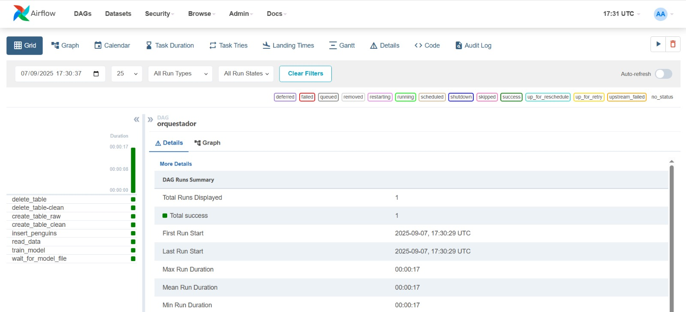
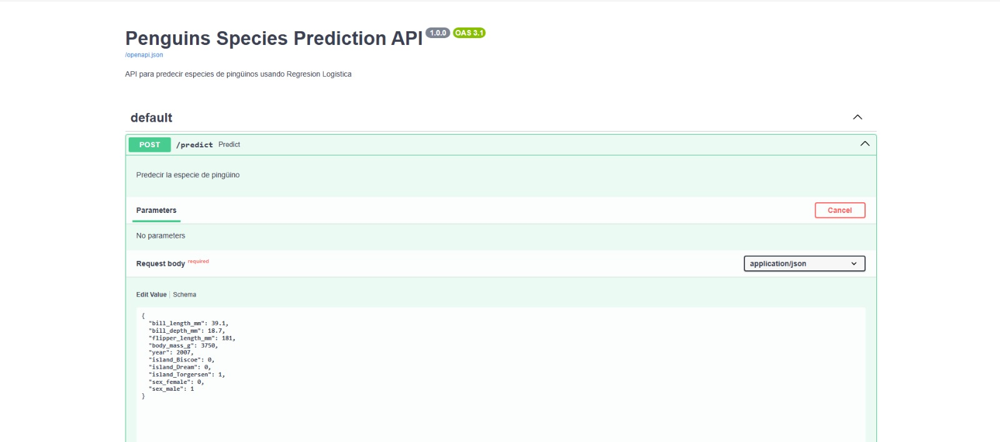

# MLOps Taller 3 - Pipeline Automatizado con Airflow

**Grupo compuesto por Sebastian Rodríguez y David Córdova**

Este proyecto implementa un pipeline completo de Machine Learning Operations (MLOps) que automatiza desde la limpieza de datos hasta el entrenamiento de modelos y despliegue de API, utilizando Apache Airflow como orquestador principal.

## Características Principales

- Pipeline completamente automatizado - Ejecución automática sin intervención manual
- Orquestación con Apache Airflow - Gestión inteligente del flujo de trabajo
- Contenerización completa - Docker Compose para todos los servicios
- Base de datos MySQL - Almacenamiento persistente de datos
- API FastAPI - Servicio de predicciones en tiempo real
- Auto-trigger del DAG - Activación automática al iniciar el sistema
- Monitoreo en tiempo real - Dashboard web de Airflow

## Estructura del Proyecto

```
MLOps_Taller3/
├── dags/
│   ├── scripts/
│   │   ├── __pycache__/
│   │   ├── __init__.py
│   │   ├── funciones.py
│   │   └── queries.py
│   ├── fastapi_ready.txt
│   ├── fastapi.log
│   └── orquestador.py
├── fastapi/
│   ├── __pycache__/
│   ├── Dockerfile
│   ├── main.py
│   └── requirements.txt
├── logs/
├── models/
├── plugins/
├── images/
├── .env
├── docker-compose.yaml
└── README.md
```

### Descripción de Componentes

- **dags/**:
  - **orquestador.py**: DAG principal de Airflow que automatiza todo el pipeline de Machine Learning.
  - **scripts/funciones.py**: Funciones principales del pipeline (insert_data, read_data, train_model).
  - **scripts/queries.py**: Consultas SQL para creación y manipulación de tablas en MySQL.
  - **fastapi_ready.txt**: Archivo de señal para indicar que FastAPI está listo.
  - **fastapi.log**: Logs del servicio FastAPI.

- **fastapi/**:
  - **main.py**: Aplicación principal de FastAPI que consume los modelos entrenados.
  - **Dockerfile**: Contenerización del servicio API.
  - **requirements.txt**: Dependencias específicas para el servicio FastAPI.

- **logs/**:
  - Directorio donde Airflow almacena todos los logs de ejecución de tareas y DAGs.

- **models/**:
  - Carpeta compartida que almacena los modelos entrenados en formato pickle (.pkl).
  - Es montada como volumen en todos los contenedores que necesitan acceso a los modelos.
  - Contiene archivos como: `RegresionLogistica.pkl`.

- **plugins/**:
  - Directorio para plugins personalizados de Airflow (vacío por defecto).

- **images/**:
  - Carpeta para almacenar capturas de pantalla y evidencias del funcionamiento del sistema.

- **.env**:
  - Archivo de variables de entorno que configura automáticamente las credenciales de Airflow.
  - Elimina la necesidad de configuración manual con credenciales predeterminadas (admin/admin).

- **docker-compose.yaml**:
  - Archivo de orquestación que define y gestiona todos los contenedores del proyecto.
  - Incluye servicios para: Airflow (webserver, scheduler, worker, triggerer), MySQL, Redis, PostgreSQL, FastAPI.
  - Contiene el servicio `dag-auto-trigger` que ejecuta automáticamente el pipeline después del inicio.
  - Facilita el montaje de volúmenes para compartir modelos y datos entre contenedores.
  - Configura la red interna para comunicación entre servicios.

---

## Automatización Implementada

### Por qué se automatizó

**Problema original:**
- Requería login manual en Airflow (`admin`/`admin`)
- Necesitaba activar DAGs manualmente
- Requería trigger manual del pipeline
- Intervención humana en múltiples pasos

**Solución automatizada:**
- Zero-touch deployment - Una sola ejecución automatiza todo
- Auto-activación de DAGs - Se activan automáticamente al iniciar
- Auto-trigger del pipeline - Se ejecuta automáticamente una vez
- Credenciales simplificadas - Admin/admin predeterminado

### Componentes de Automatización

#### Archivo .env - Configuración Automática

```bash
# Variables de entorno para automatización
AIRFLOW_UID=50000
_AIRFLOW_WWW_USER_USERNAME=admin
_AIRFLOW_WWW_USER_PASSWORD=admin
AIRFLOW_PROJ_DIR=.
```

**Función:** Elimina la necesidad de configuración manual de credenciales.

#### docker-compose.yaml - Orquestación Automática

**Características de automatización implementadas:**

```yaml
# DAGs activos por defecto (sin intervención manual)
AIRFLOW__CORE__DAGS_ARE_PAUSED_AT_CREATION: 'false'

# Detección rápida de cambios en DAGs
AIRFLOW__SCHEDULER__DAG_DIR_LIST_INTERVAL: 30
AIRFLOW__SCHEDULER__PARSING_PROCESSES: 2
```

**Servicio de Auto-Trigger integrado:**
```yaml
dag-auto-trigger:
  command: >
    bash -c "
      echo 'Iniciando auto-trigger del DAG...'
      sleep 120
      echo 'Activando DAG orquestador...'
      airflow dags unpause orquestador || echo 'DAG ya está activo'
      echo 'Disparando ejecución del DAG...'
      airflow dags trigger orquestador
      echo 'DAG disparado exitosamente!'
    "
```

**Función:** Ejecuta automáticamente el pipeline 2 minutos después del inicio completo.

#### DAG Modificado - orquestador.py

**Configuración para auto-activación:**
```python
with DAG(
    dag_id="orquestador",
    schedule_interval=None,          # Ejecución controlada automáticamente
    catchup=False,
    is_paused_upon_creation=False,   # CLAVE: DAG activo desde creación
    tags=['ml', 'penguins', 'auto-execution']
) as dag:
```

**Función:** Garantiza que el DAG esté listo para ejecución automática.

## Flujo del Pipeline Automatizado

### Secuencia de Ejecución Automática:

1. docker-compose up
2. Servicios iniciando (MySQL + Redis + PostgreSQL)
3. Airflow Webserver + Scheduler
4. DAG auto-activo
5. Auto-trigger después de 120 segundos
6. Pipeline ML ejecutándose automáticamente

### Tareas del DAG:

1. **delete_table** - Limpia tabla anterior de datos raw
2. **delete_table_clean** - Limpia tabla anterior de datos procesados  
3. **create_table_raw** - Crea tabla para datos originales
4. **create_table_clean** - Crea tabla para datos limpios
5. **insert_penguins** - Carga dataset Palmer Penguins a MySQL
6. **read_data** - Lee y procesa datos desde MySQL
7. **train_model** - Entrena modelo de Regresión Logística
8. **wait_for_model_file** - Verifica que modelo esté guardado
9. **pipeline_completion** - Confirma finalización exitosa

## Instrucciones de Ejecución

### Preparación Inicial

```bash
# Clonar el repositorio
git clone https://github.com/DAVID316CORDOVA/MLOps_Taller3.git
cd MLOps_Taller3

# Limpiar entorno previo (si existe)
docker-compose down -v
docker system prune -f
```

### Ejecución Completamente Automática (Recomendado)

```bash
# Después de la preparación inicial, simplemente:
docker-compose up
```

**Qué sucede automáticamente:**
- Se crean todos los contenedores necesarios
- Airflow inicia con credenciales admin/admin
- DAG se activa automáticamente
- Pipeline se ejecuta una vez automáticamente después de 2 minutos
- FastAPI queda disponible con modelo entrenado

### Ejecución en Background

```bash
# Para ejecutar en segundo plano
docker-compose up -d

# Ver logs en tiempo real
docker-compose logs -f dag-auto-trigger
```

### Verificación Manual del Estado

```bash
# Verificar que Airflow esté disponible
curl -f http://localhost:8080/health

# Verificar estado de contenedores
docker-compose ps

# Acceder a la interfaz web
# http://localhost:8080 (admin/admin)
```

## Acceso a Servicios

| Servicio | URL | Credenciales | Descripción |
|----------|-----|--------------|-------------|
| **Airflow Web** | http://localhost:8080 | admin/admin | Dashboard del pipeline |
| **FastAPI Docs** | http://localhost:8000/docs | - | API de predicciones |
| **MySQL** | localhost:3306 | my_app_user/my_app_pass | Base de datos |
| **Flower (opcional)** | http://localhost:5555 | - | Monitor de Celery |

## Evidencia Visual

### Ejecución de la aplicación


### Login de Airflow


### Dashboard de Airflow - DAG Auto-Activo


### Ejecución Automática del Pipeline - DAG Auto-Activo



## Visualización todos los tasks de Airflow ejecutándose automaticamente


## Visualización de la interfaz gráfica de FASTAPI 




## Predicción usando el modelo genero automáticamente por AirFlow


*Espacio reservado para imagen del DAG activo automáticamente*


*Espacio reservado para imagen del pipeline ejecutándose*


### Tareas Completadas Exitosamente

*Espacio reservado para imagen de todas las tareas verdes*


### Modelo Generado Automáticamente

*Espacio reservado para imagen del archivo .pkl creado*


### FastAPI Funcionando con Modelo

*Espacio reservado para imagen de FastAPI docs con predicción*


### Predicción Exitosa

*Espacio reservado para imagen de predicción exitosa*


## Funciones Técnicas Implementadas

### funciones.py - Lógica del Pipeline

```python
def insert_data():
    """Carga datos Palmer Penguins a MySQL"""
    # Carga dataset palmerpenguins
    # Limpia valores nulos
    # Inserta datos en tabla MySQL raw

def read_data():
    """Lee y procesa datos desde MySQL"""
    # Conecta a base de datos MySQL
    # Lee datos de tabla raw
    # Aplica transformaciones y limpieza
    # Guarda datos procesados en tabla clean

def train_model():
    """Entrena modelo de clasificación"""
    # Carga datos procesados desde MySQL
    # Prepara features y target
    # Entrena modelo de Regresión Logística
    # Guarda modelo en /opt/airflow/models/RegresionLogistica.pkl
```

### queries.py - Consultas SQL

```sql
CREATE_PENGUINS_TABLE_RAW = """
    CREATE TABLE IF NOT EXISTS penguins_raw (
        species VARCHAR(50),
        island VARCHAR(50),
        bill_length_mm FLOAT,
        bill_depth_mm FLOAT,
        flipper_length_mm FLOAT,
        body_mass_g INT,
        sex VARCHAR(10)
    )
"""

CREATE_PENGUINS_TABLE_CLEAN = """
    CREATE TABLE IF NOT EXISTS penguins_clean (
        species INT,
        island_biscoe INT,
        island_dream INT,
        island_torgersen INT,
        bill_length_mm FLOAT,
        bill_depth_mm FLOAT,
        flipper_length_mm FLOAT,
        body_mass_g INT,
        sex_female INT,
        sex_male INT
    )
"""
```

## Beneficios de la Automatización

| **Antes (Manual)** | **Después (Automatizado)** |
|--------------------|-----------------------------|
| Login manual requerido | Acceso automático con admin/admin |
| Activar DAGs manualmente | DAGs activos automáticamente |
| Trigger manual del pipeline | Auto-ejecución programada |
| 5-7 pasos manuales | 1 comando: `docker-compose up` |
| Propenso a errores humanos | Proceso consistente y repetible |
| Tiempo: ~10-15 minutos | Tiempo: ~3-5 minutos sin intervención |

## Troubleshooting

### Problema: DAG no se ejecuta automáticamente
```bash
# Verificar que el servicio auto-trigger se ejecutó
docker-compose logs dag-auto-trigger

# Ejecutar manualmente si es necesario
docker exec -it $(docker-compose ps -q airflow-scheduler) airflow dags trigger orquestador
```

### Problema: Error de permisos
```bash
# Establecer AIRFLOW_UID correcto
echo "AIRFLOW_UID=$(id -u)" > .env
docker-compose down -v
docker-compose up
```

### Problema: MySQL no conecta
```bash
# Verificar que MySQL esté corriendo
docker-compose ps mysql

# Verificar logs
docker-compose logs mysql
```

### Problema: Puertos ocupados
```bash
# Verificar puertos en uso
netstat -tlnp | grep -E '8080|8000|3306'

# Detener otros servicios si es necesario
docker-compose down
sudo systemctl stop mysql  # Si MySQL local está corriendo
```

## Tecnologías Utilizadas

| Categoría | Tecnología | Propósito |
|-----------|------------|-----------|
| **Orquestación** | Apache Airflow 2.6.0 | Pipeline automation |
| **Contenerización** | Docker + Docker Compose | Service orchestration |
| **Base de Datos** | MySQL 8.0 | Data persistence |
| **Cache/Queue** | Redis + PostgreSQL | Airflow backend |
| **API Framework** | FastAPI + Uvicorn | Model serving |
| **ML Libraries** | scikit-learn, pandas | Model training |
| **Task Queue** | Celery | Distributed task execution |

## Logs y Monitoreo

### Ubicación de Logs:
- **Airflow Logs:** `./logs/`
- **FastAPI Logs:** `./dags/fastapi.log`
- **Container Logs:** `docker-compose logs [service-name]`

### Comandos de Monitoreo:
```bash
# Ver logs en tiempo real de todos los servicios
docker-compose logs -f

# Ver logs específicos de un servicio
docker-compose logs airflow-scheduler
docker-compose logs fastapi
docker-compose logs mysql
docker-compose logs dag-auto-trigger

# Verificar estado de contenedores
docker-compose ps

# Ver uso de recursos
docker stats
```

## Conclusiones

Este proyecto demuestra una implementación exitosa de MLOps con automatización completa:

1. **Pipeline End-to-End:** Desde datos raw hasta modelo productivo
2. **Zero-Touch Deployment:** Una ejecución automatiza todo el proceso
3. **Escalabilidad:** Arquitectura preparada para múltiples modelos
4. **Monitoreo:** Dashboard web para seguimiento en tiempo real
5. **Reproducibilidad:** Proceso completamente documentado y repetible

La automatización elimina errores humanos y reduce significativamente el tiempo de despliegue, estableciendo una base sólida para operaciones de Machine Learning en producción.

---

**Desarrollado por:**
- Sebastian Rodríguez
- David Córdova

**Proyecto:** MLOps Taller 3 - Pipeline Automatizado  
**Fecha:** Septiembre 2025
